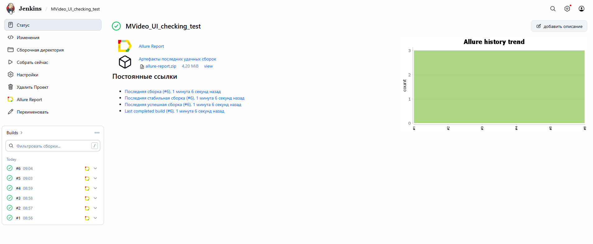
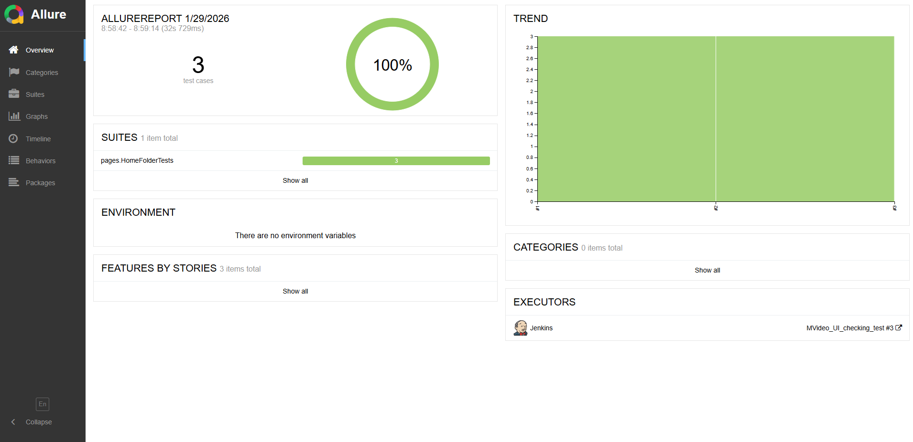
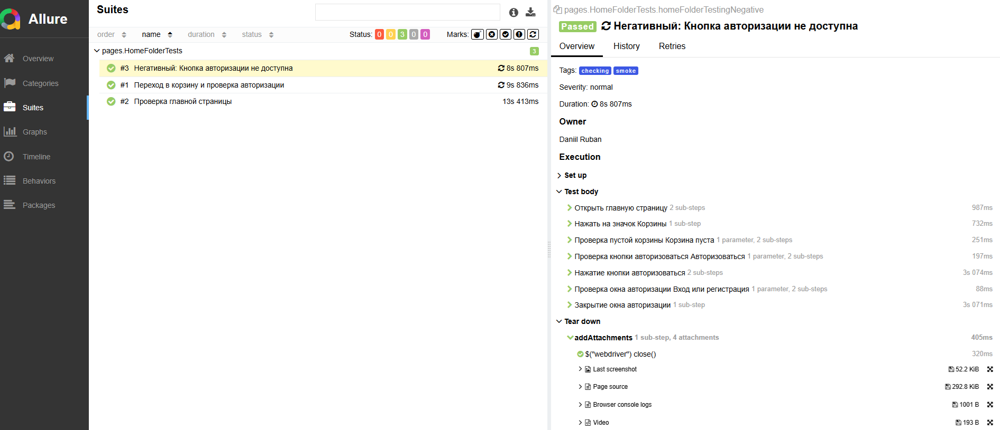
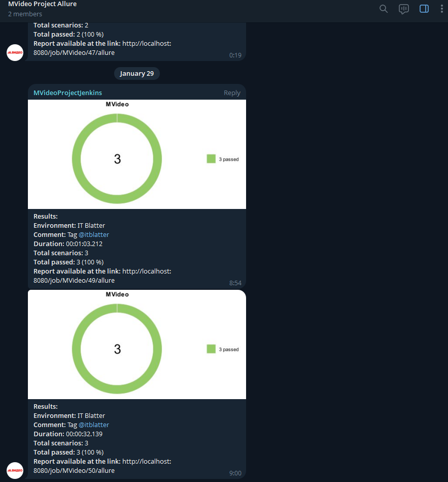

# Проект по автоматизации тестирования для компании [МВидео](https://mvideo.ru/) 
> «М.Видео» — это ведущая российская публичная компания и одна из крупнейших розничных сетей, специализирующаяся на продаже бытовой техники, электроники, гаджетов и аксессуаров.
> Основные цели включают проверку функциональности сайта, генерацию подробных отчетов и интеграцию с CI/CD.


## **Содержание:**

* <a href="#tools">Стек технологий</a>

* <a href="#jenkins">Сборка в Jenkins</a>

* <a href="#allure">Allure отчет</a>

* <a href="#telegram">Уведомление ботом в Telegram о сборке</a>

* <a href="#other">Версии</a>


## Стек технологий:
<p align="center">  
<a href="https://www.jetbrains.com/idea/"></a>  
<a href="https://www.java.com/"></a>  
<a href="https://github.com/"></a>  
<a href="https://junit.org/junit5/"></a>  
<a href="https://gradle.org/"></a>  
<a href="https://aerokube.com/selenoid/"></a>
<a href="https://github.com/allure-framework/allure2"></a> 
<a href="https://qameta.io/"></a> 
<a href="https://www.jenkins.io/"></a> 
<a href="https://web.telegram.org/"></a>  
<a href="https://www.atlassian.com/ru/software/jira/"></a>  
<a href="https://selenide.org/"></a>  


</p>

- **IntelliJ IDEA**: Среда разработки для написания кода.  
- **Java**: Основной язык программирования используемый в проекте.  
- **GitHub**: Платформа для совместной разработки проекта и хостинга.  
- **JUnit 5**: Фреймворк для написания и выполнения тестов.  
- **Gradle**: Система сборки проекта.  
- **Selenide**: Библиотека для написания UI тестов.  
- **Allure**: Фреймворк для генерации отчетов о выполнении тестирования.  
- **Jenkins**: Инструмент для автоматизации сборки и CI/CD.  
- **Telegram**: Мессенджер для отправки уведомлений о сборке проекта.  
- **Allure TestOps**: Платформа для управления тестированием и анализа результатов прохождения тестов. 
- **Jira**: Платформа для управления проектами и отслеживания задач.
<a id="jenkins"></a>

<a id="jenkins"></a>
## </a><a name="Сборка"></a>Сборка в [Jenkins]</a>
Jenkins используется для автоматизации сборки и тестирования проекта. Он позволяет каждому члену команды запускать любые тесты в любое время. В данном проекте сборка выполняется автоматически каждые 4 часа.
<p align="center">  
</a>  
</p>


### **Параметры сборки в Jenkins:**

- browser – браузер, по умолчанию chrome
- browserVersion – версия браузера, по умолчанию 122
- browserSize – размер окна браузера, по умолчанию 1920x1080
- remoteUrl – логин, пароль и адрес удаленного сервера Selenoid

- ## Команды для запуска из терминала

***Локальный запуск:***
```bash  
gradle checking_test

```

***Удаленный запуск в Jenkins:***
```bash  
cheking_test
```

<a id="allure"></a>
## </a> <a name="Allure"></a>Allure [отчет](https://jenkins.autotests.cloud/job/MVideo_UI_cheking/5/allure)</a>

Allure используется для генерации подробных отчетов о тестировании. Он предоставляет информацию о результатах тестов, включая графики и диаграммы, что помогает анализировать качество продукта и выявлять проблемные области.
</p>

### Главная страница

<p align="center">  
  
</p>

### Пример теста

  <p align="center">  

</p>

<a id="telegram"></a>
## </a> Интеграция с Telegram. Автоматические уведомления о сборке
Настроены автоматические уведомления в Telegram для получения информации о статусе сборки и тестирования.

<p align="center">  
  
</p>

<a id="other"></a>
### Плагины
- **java-library**: Плагин для работы с Java библиотеками.
- **io.qameta.allure (версия 2.11.2)**: Плагин для интеграции с Allure для генерации отчетов.

### Репозитории
- **mavenCentral**: Репозиторий Maven Central для получения зависимостей.

### Зависимости (Dependencies)
- **Selenide (версия 7.2.1)**: Фреймворк для написания лаконичных и стабильных UI тестов на Java.
- **JUnit 5 (версия 5.10.1)**: Фреймворк для модульного тестирования на Java.
- **Java Faker (версия 1.0.2)**: Библиотека для генерации фейковых данных для тестирования.
- **Allure Selenide (версия 2.25.0)**: Для интеграции Selenide с Allure для детализированных отчетов.
- **SLF4J Simple (версия 2.0.7)**: Простая фасадная библиотека для логирования в Java.

### Конфигурация
- **Конфигурация Allure** для генерации отчетов и использования AspectJ Weaver.
- **Конфигурация задач тестирования** для использования JUnit Platform и логирования определенных событий тестов.
- Передача системных свойств в задачи тестирования.
- Условное включение тегов тестов на основе системных свойств.

### Классы помощники (Helper Classes)
- **Attach**: Содержит методы для захвата скриншотов, исходного кода страницы, логов консоли браузера и встраивания видео в отчеты
- Использованал Selenoid для удаленного запуска брузеров в Docker контейнерах

### Интеграция с Telegram
Была выполнена интеграция с Telegram для автоматической сборки (в Jenkins) и отправки отчетности в Telegram канал каждые 6 часов
</p>